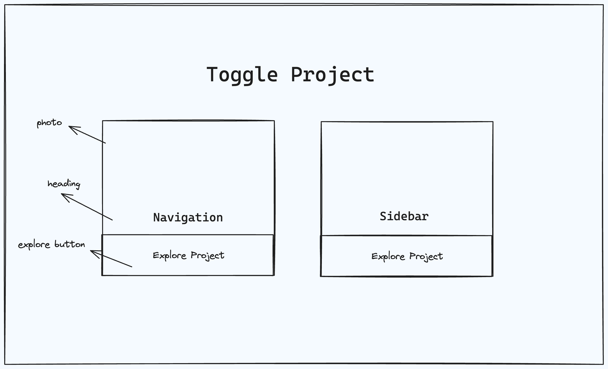
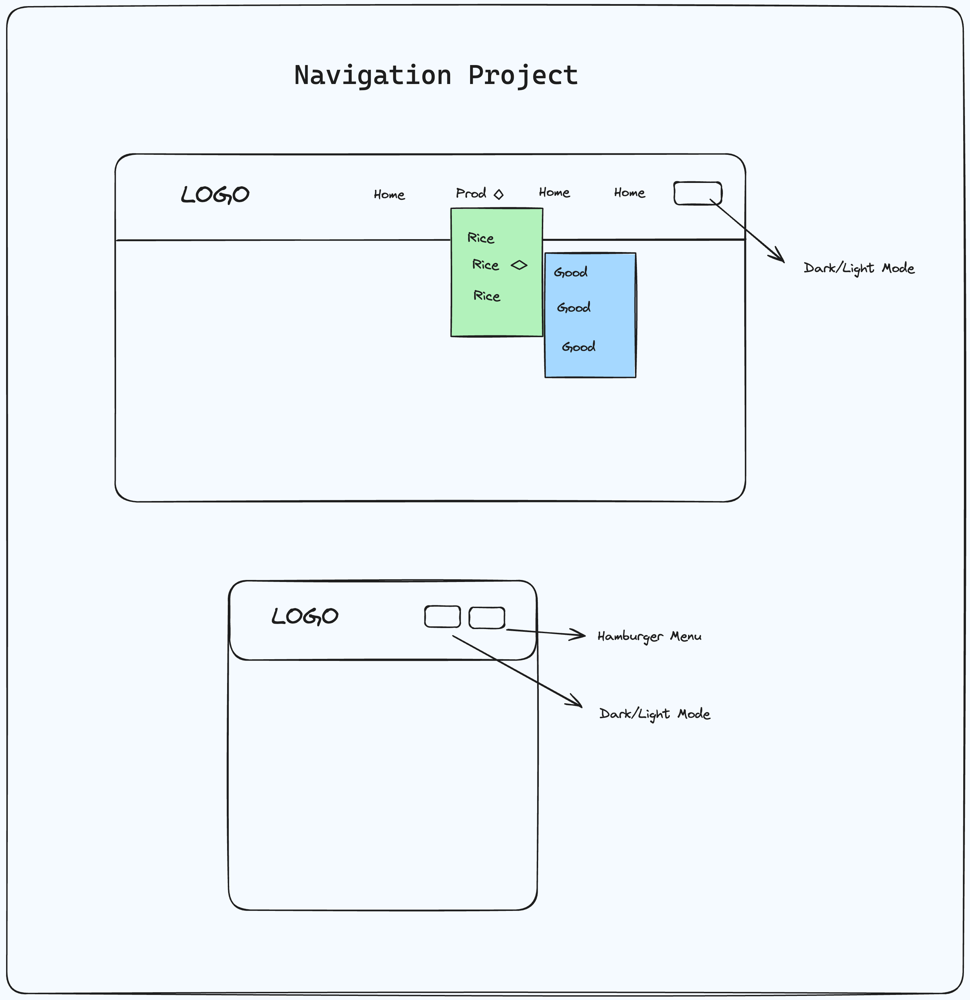
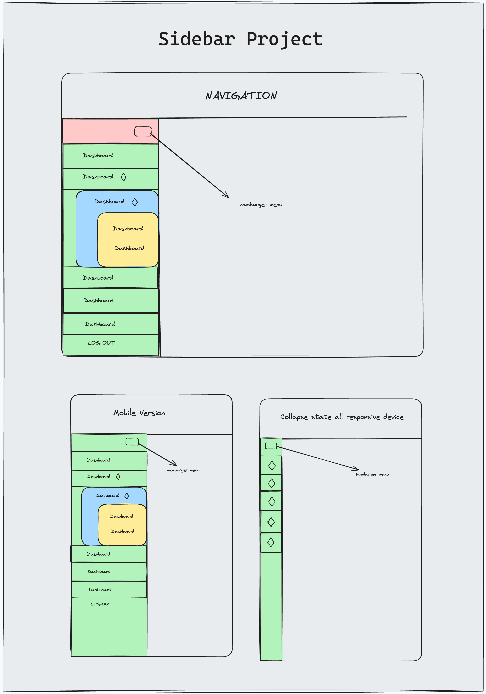

#### Project Number - One [Toggle Project - Navigation & Sidebar]

A site will have two cards in the middle of the home page, which will be linked to two pages.

For a visual referrence, you may have a look into this home page layout:

The first card name will be **"Navigation"**. Which must have to include ___

1. Navigation that will have dropdown items using JS.
2. It will be sticky navigation [ kindly expand the body using dummy data so that you can check whether sticky navigation works perfectly ]
3. A toggle "hamburger menu" for responsive devices [It must have a minimum of two breakpoints ].
4. A toggle icon for dark and light mode.[ make sure that if the toggle changes not only the background but also the content color should update according to the toggle state]

For a visual referrence, you may have a look into this layout:

The second card name will be **"Sidebar"**. Which must have to include ___

1. The sidebar will contain Nested sidebar items.
2. A toggle menu for collapsing and expanding the sidebar. [ you can follow the VS Code sidebar as a reference ]
3. It must have to be responsive so it can fit in responsive devices.

For a visual referrence, you may have a look into this layout:

**Note: Search for design and layout. Plan this project by yourself. Try to write CSS by searching properties. Imagine and write JavaScript logic for desired functionalities by yourself, even if it's initially incorrect, and use console logs to find your mistakes and re-write the correct logic.**

After Completion of this small project :

- You can build any navigation and sidebar for any project.
- It will help you to understand and write code for any toggle functionality. [Ex - if you want to toggle className in any project based on DOM events, you can use this concept]
- Moreover, it'll help you to understand the concept and behavior behind the scenes of the navigation element and sticky navbar and debug like a pro in your current workplace.
